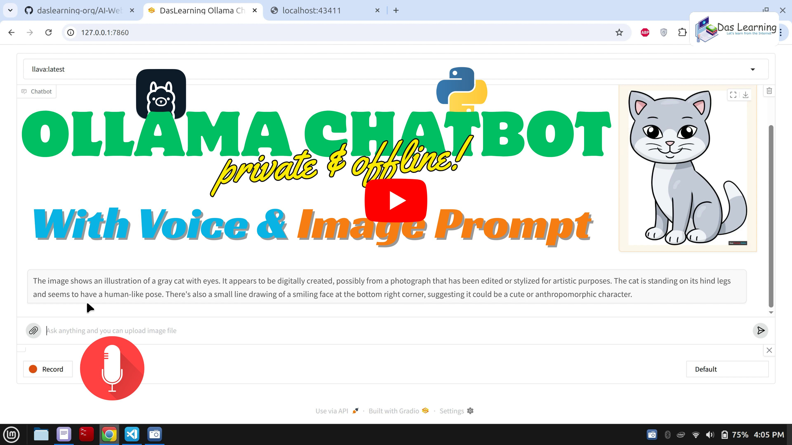

# 🗪 Multimodal Web Chatbot for Ollama
A web based AI Chatbot for Ollama made on Gradio (Python) which supports Voice input to interact with ollama LLM models. If you have a vision capable LLM like `llava`, you can even upload an image with your query. This is offline and private AI chatbot. This does not require an active Internet connection except for the first time (to download the voice to text model)

> A Private Ollama Chatbot, which is a Web based application. This Chatbot is made with Python Gradio which supports text and audio prompt. If you have a LLM which with `vision` capabilty, you can also use an image with your text prompt. If you run the application for the first time (also for docker), it will try to download the voice to text model (vosk) which may take a little time to start. You may follow along the documentations as written below.

## 📽️ Demo
You can click on the below Image or this [Youtube Link](https://www.youtube.com/watch?v=KCjXPFAyalA) to see the demo. Please let me know in the comments, how do you feel about this App. <br>
[](https://www.youtube.com/watch?v=KCjXPFAyalA)

## 🧑‍💻 Quickstart Guide

### 🐋 Run on Docker
Pull & simply Run. You need to provide your `Ollama Endpoint`, do not provide `localhost` as it will look into container's localhost. Check the latest version on [docker hub](https://hub.docker.com/r/sdas92/ai-ollama-chatbot)
```bash
docker pull sdas92/ai-ollama-chatbot:v0.2.0
docker run -d -p 7860:7860 --name ollama-chatbot sdas92/ai-ollama-chatbot:v0.2.0
```

### 🐍 Run on Python
```bash
git clone https://github.com/daslearning-org/AI-Web-Chatbot-Ollama.git
cd ./AI-Web-Chatbot-Ollama/chatbot/
python -m venv .venv
source .venv/bin/activate # use .\venv\Scripts\activate on windows
pip install -r requirements.txt

# run the app
python app.py # you can open the web ui at port 7860
```

## 🐋 Build Docker Image
Build your own image, you need to change your repo details
```bash
git clone https://github.com/daslearning-org/AI-Web-Chatbot-Ollama.git
cd ./AI-Web-Chatbot-Ollama/chatbot/
VERSION_FILE="VERSION"
APP_VERSION=$(< "$VERSION_FILE" tr -d '\n\r' | xargs)
IMAGE_URI="sdas92/ai-ollama-chatbot:${APP_VERSION}" # your repo details
docker build -t ${IMAGE_URI} .
docker push "${IMAGE_URI}"
```
